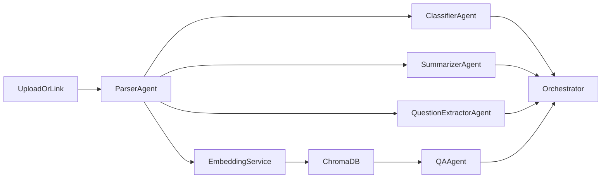

# ForInsighter 🚀

AI-powered document intelligence platform for uploading files/links, extracting structured insights, chatting with document context, and visualizing results.

## ✨ Features

- 📄 Upload and process multiple formats: PDF, CSV, XLS/XLSX, DOCX, text links, and images
- 🔍 AI summarization with document typing, key points, entities, and question extraction
- 💬 Document Chat with retrieval (RAG) + caching and source-aware responses
- 📊 Dataset profiling for tabular files with stats, quality indicators, and charts
- 🧭 View workflows for native/document rendering and highlight-driven navigation
- 🧠 Dual LLM mode: local (Ollama) or API providers (Gemini/OpenAI)

## 🏗️ Tech Stack

### Frontend
- React 18 + TypeScript + Vite
- Tailwind CSS + shadcn/ui (Radix primitives)
- Recharts for charting
- React Query, React Router, React Dropzone, Sonner

### Backend
- FastAPI + SQLAlchemy (async) + SQLite
- Celery + Redis for background processing
- ChromaDB for vector storage
- LiteLLM + provider adapters for LLM calls
- Pandas/OpenPyXL/XLRD/Python-docx/Pillow/PyMuPDF/WeasyPrint for parsing and rendering

## 📁 Project Structure

```text
ForInsighter/
├── backend/
│   ├── agents/              # AI workflow agents (parse/classify/summarize/qa/etc.)
│   ├── models/              # DB models + API schemas
│   ├── routers/             # FastAPI route modules
│   ├── services/            # LLM, vector DB, caching, chart services
│   ├── tasks/               # Celery task workers
│   ├── utils/               # Parsers/chunkers/helpers
│   ├── main.py              # FastAPI app entrypoint
│   ├── requirements.txt     # Python dependencies
│   └── .env.example         # Environment template
├── src/
│   ├── api/                 # Frontend API client
│   ├── components/          # Shared UI components
│   ├── context/             # App state/config context
│   ├── pages/               # Route pages (Dashboard, DocumentViewer, etc.)
│   ├── types/               # Frontend types/contracts
│   └── main.tsx             # Frontend app bootstrap
├── public/                  # Static assets
├── package.json             # Frontend scripts/dependencies
└── vite.config.ts           # Vite config
```

## 🧩 What Key Files Do

### Backend
- `backend/main.py`: FastAPI app setup, CORS config, router registration, startup init.
- `backend/routers/documents.py`: Upload/link ingest, processing triggers, view/highlight endpoints.
- `backend/routers/analysis.py`: Summary/entities/questions/charts APIs.
- `backend/routers/chat.py`: Chat endpoints, history management, fast tabular-answer path.
- `backend/agents/orchestrator.py`: Central workflow orchestrator across agents/services.
- `backend/agents/parser_agent.py`: Dispatch parser by file type and produce chunks/metadata.
- `backend/agents/summarizer_agent.py`: Structured summaries with caching and chunk-merging.
- `backend/agents/qa_agent.py`: Retrieval + grounded answer generation + cache keys.
- `backend/utils/excel_parser.py`: High-speed tabular parsing and profiling (CSV/XLS/XLSX).
- `backend/services/llm_service.py`: LLM abstraction (local/API modes, retries, structured output).
- `backend/services/chroma_service.py`: Vector collection add/query/delete operations.
- `backend/services/cache_service.py`: Cache helpers used by summary/chat pipelines.
- `backend/tasks/celery_tasks.py`: Async background document and batch job processing.

### Frontend
- `src/pages/Dashboard.tsx`: Upload area, link ingestion, document list/search, batch navigation.
- `src/pages/DocumentViewer.tsx`: Summary/details/charts/comparison + Document Chat UI.
- `src/api/client.js`: Backend API client wrapper and request/error handling.
- `src/context/AppContext.tsx`: App-wide config (mode/provider/model) and document state.
- `src/types/index.ts`: Shared frontend contracts for docs/chat/charts/config.

## 🤖 Agents and Orchestration

ForInsighter uses an orchestrated agent-style backend:

1. **ParserAgent** parses file/link content into normalized text/chunks + metadata.
2. **ClassifierAgent** predicts document type.
3. **SummarizerAgent** generates structured summaries (cached).
4. **QuestionExtractorAgent** extracts likely user questions.
5. **QAAgent** performs retrieval against Chroma vectors and answers with citations.
6. **Orchestrator** coordinates all above components and merges outputs for persistence.

### Flow



## 📚 Library Inventory

### Python (`backend/requirements.txt`)
- `fastapi`, `uvicorn`, `python-multipart`
- `sqlalchemy`, `alembic`, `aiosqlite`
- `pydantic`, `pydantic-settings`
- `celery`, `redis`
- `litellm`, `langchain`, `langchain-community`, `langgraph`
- `sentence-transformers`, `chromadb`
- `pymupdf`, `openpyxl`, `pandas`, `xlrd`
- `weasyprint`, `python-docx`, `Pillow`
- `python-dotenv`, `httpx`, `google-generativeai`

### Frontend (`package.json`)
- Core: `react`, `react-dom`, `typescript`, `vite`
- UI: Radix UI packages, `tailwindcss`, `tailwind-merge`, `lucide-react`
- Data/routing/state: `@tanstack/react-query`, `react-router-dom`
- Upload/forms/charts: `react-dropzone`, `react-hook-form`, `recharts`, `zod`
- UX utilities: `sonner`, `next-themes`, `date-fns`, `cmdk`

## ⚙️ Prerequisites

- Node.js 18+ and npm
- Python 3.10+
- Redis (for Celery queue)
- Optional local LLM runtime (Ollama) if using local mode

## 🚀 Run Locally

### 1) Clone and install frontend

```bash
git clone <your-repo-url>
cd ForInsighter
npm install
```

### 2) Setup backend

```bash
cd backend
python -m venv venv
source venv/bin/activate
pip install -r requirements.txt
cp .env.example .env
```

### 3) Start backend API

```bash
cd backend
source venv/bin/activate
uvicorn main:app --reload --port 8000
```

### 4) Start Redis + Celery worker (recommended)

```bash
# Terminal A (Redis)
redis-server

# Terminal B (Celery worker)
cd backend
source venv/bin/activate
celery -A tasks.celery_tasks.celery_app worker --loglevel=info
```

### 5) Start frontend

```bash
cd /path/to/ForInsighter
npm run dev
```

Frontend runs on `http://localhost:8080` and backend on `http://localhost:8000`.

## 🔐 Environment Notes

Use `backend/.env` to configure:
- `LLM_MODE` (`local` or `api`)
- `OLLAMA_BASE_URL`, `OLLAMA_MODEL`
- `API_PROVIDER`, `API_MODEL`, and provider keys (`GEMINI_API_KEY`/`OPENAI_API_KEY`)
- Optional paths for uploads/vector storage

## 🧪 Useful Commands

```bash
# Frontend checks
npm run lint
npm run test
npm run build

# Backend syntax check
python -m compileall backend
```

## 📌 Git Tips For This Repo

- Keep runtime/generated data out of git (`backend/uploads`, `backend/chroma_db`, `backend/docplatform.db`, virtualenvs, build outputs).
- Only commit source code/config/docs needed for reproducible setup.
- Use `.env.example` as template; never commit real API keys.

---

Built with ❤️ for document intelligence workflows.
